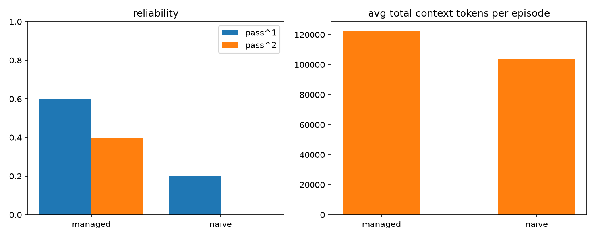
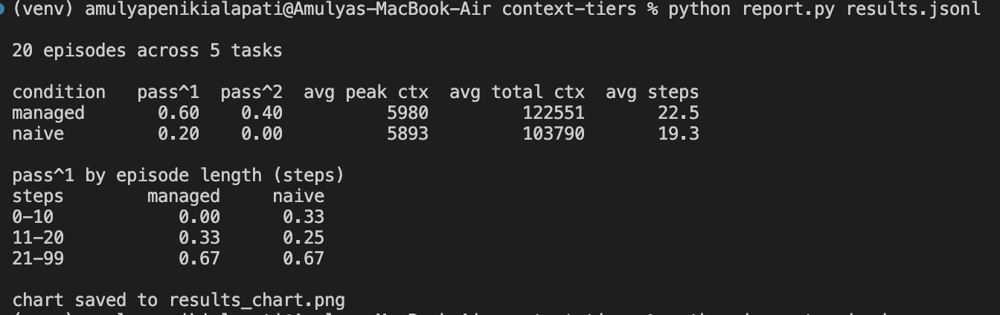

# context-tiers

**Context management for AI agents under a fixed token budget.**

A context window is less a budget problem than an engineering one. Raising the token limit does not fix an agent that keeps the wrong things. What matters is the logic that decides what stays.

`context-tiers` is a context-management library that allocates a fixed token budget across agent history based on the value of each piece of information. Instead of blindly dropping the oldest messages, it protects information that can change the outcome of a task and removes information that is cheaper to lose.

```bash
pip install context-tiers
```

## Why

Most agents handle context overflow by deleting the oldest messages.

That sounds reasonable until the oldest message contains something like this.

> "Pay with miles, not the card."

If that message disappears, the agent can make the wrong payment decision, fail the task, and leave no obvious explanation for why.

The information worth keeping is rarely determined by recency alone.

`context-tiers` treats context as a **resource-allocation problem**.

## How it works

Different types of information receive different treatment.

| Content | Treatment |
|---|---|
| System rules | Never removed |
| Hard customer constraints | Detected and protected |
| Recent conversation | Preserved verbatim |
| Old tool results | Compressed field-by-field |
| Old small talk | Dropped first |

Each category receives a priority tier. A fixed token budget is then allocated from the highest-priority information downward until the budget is exhausted.

```python
from context_tiers import ContextManager

cm = ContextManager(budget=6000)

cm.add(
    "system",
    "You are a booking agent. Refunds go to the original payment method."
)

cm.add(
    "user",
    "Pay with miles, not the credit card."
)

messages, trace = cm.build(trace=True)
```

The result is an OpenAI-compatible message history that fits the requested budget.

The manager can also produce a structured trace explaining which content was kept, compressed, or dropped and how the token budget was allocated.

## Architecture

```text
                         Conversation History
                                  │
                                  ▼
                       ┌─────────────────────┐
                       │   Context Manager   │
                       └──────────┬──────────┘
                                  │
                 ┌────────────────┼────────────────┐
                 │                │                │
                 ▼                ▼                ▼
          Constraint           Recency          Content
            Pinner             Analysis        Classification
                 │                │                │
                 └────────────────┼────────────────┘
                                  ▼
                         ┌─────────────────┐
                         │ Tier Allocator  │
                         └────────┬────────┘
                                  │
                    ┌─────────────┼─────────────┐
                    │             │             │
                    ▼             ▼             ▼
                  KEEP        COMPRESS        DROP
                    │             │         (discarded)
                    │       Field-aware
                    │       compression
                    │             │
                    └──────┬──────┘
                           ▼
                    Final Context Budget
                           │
                           ▼
                       Agent / LLM
```

The important distinction is that compression is **not purely textual**.

For structured tool results, the compressor reasons about individual fields so important values such as reservation IDs, payment records, and other identifiers can survive even when the surrounding response is shortened.

## Design principles

### 1. Protect decisions, not just recent messages

A hard customer constraint can be more important than a recent conversational turn.

The manager therefore detects constraints such as these.

```text
"Pay with miles, not the credit card."
"Don't change the first reservation."
"Refund the original payment method."
```

and protects the information required to act on them.

### 2. Compress structured data intelligently

Naively truncating JSON can remove the one field an agent actually needs.

Instead, tool results are compressed at the field level so important identifiers and state can survive while low-value fields are removed.

### 3. Spend the budget deliberately

The system does not assume that every token in the history has equal value.

When the budget is constrained, higher-priority information gets the available space first.

### 4. Make allocation decisions inspectable

Every build can produce a trace containing the allocation decisions and token accounting.

This makes context management observable rather than an opaque preprocessing step.

## Evaluation on tau-bench

The system was integrated with [tau-bench](https://github.com/sierra-research/tau-bench), Sierra's benchmark for tool-using customer-service agents.

Two agents run the same airline customer-service tasks under the same model and context budget.

- **Tiered management** uses `context-tiers`
- **Naive truncation** removes oldest messages first

The model, tasks, budget, and prompting were held constant so the primary difference was the context-management strategy.

### Benchmark setup

- **20 episodes**
- **5 airline customer-service tasks**
- **2 attempts per task**
- **gpt-5-mini**
- **6,000-token shared context budget**

The benchmark also counts tool schemas as part of the context budget. These account for roughly 2,400 hidden tokens sent with each request and would otherwise make the comparison misleading.

### Results





- **Managed solved 3x as many tasks** on a single attempt.
- **Managed was the only condition to solve anything reliably.** Naive never passed the same task twice.
- **Managed used more total context, not less**, because it engaged with the hardest task instead of failing fast.

The additional context spend was real work. In the hardest task, involving downgrading five reservations with individual refunds, the managed agent continued making tool calls instead of failing early. Some additional context was also spent re-fetching reservation details that had aged out.

That behavior is itself useful evidence for the next iteration. Better context management should not only preserve important information, but also understand when information needs to remain available across a long tool-use trajectory.

These are twenty episodes on a small model at temperature one, so the rates carry variance and should be read as a direction rather than constants. The consistent finding across runs was the shape. Tiered management preserves constraints and structured fields under pressure that naive truncation can drop.

## Benchmark improvements

Building the benchmark exposed three issues worth fixing.

### Tool schemas count toward the budget

The context budget now includes tool schemas rather than counting only visible messages.

This matters because tool definitions can consume a substantial portion of the available context window on every request.

### Compression is field-aware

Structured tool results are compressed by field rather than by raw token truncation.

This allows important values such as IDs and payment records to survive compression.

### Tool roles are preserved

Historical tool results retain their original roles instead of being flattened into artificial user messages.

This preserves the semantics of the original conversation when old context is reintroduced.

## Repository

```text
context-tiers/
├── context_tiers/
│   ├── manager.py
│   ├── allocator.py
│   ├── summarizer.py
│   ├── pinner.py
│   └── redis_store.py
│
├── adapter.py
├── runner.py
├── inspect_episode.py
├── demo.py
└── ...
```

| Path | Purpose |
|---|---|
| `context_tiers/manager.py` | Main context manager |
| `context_tiers/allocator.py` | Tiered budget allocation |
| `context_tiers/summarizer.py` | Field-aware compression |
| `context_tiers/pinner.py` | Hard-constraint detection |
| `context_tiers/redis_store.py` | Optional Redis backend |
| `adapter.py` | tau-bench integration |
| `runner.py` | Benchmark runner with checkpointing and resume |
| `inspect_episode.py` | Episode inspection and failure analysis |

## Try it

```bash
git clone https://github.com/AmulyaP07-15/context-tiers.git
cd context-tiers

python3 -m venv venv
source venv/bin/activate

pip install -e ".[redis]"
python demo.py
```

## Limitations

The current constraint detector relies primarily on keyword and pattern matching.

That works for explicit instructions like these.

```text
"Pay with miles."
"Don't use the credit card."
```

but can miss paraphrases like this one.

```text
"Charge it to my miles."
```

The current benchmark is also intentionally small. The results demonstrate a direction rather than establishing a statistically conclusive performance difference.

## v2

### Semantic relevance

Add an optional embedding model alongside the keyword-based constraint layer to detect semantically equivalent instructions while keeping the core library dependency-free by default.

### Constraint-aware compression

Link each detected constraint to the entities it refers to.

Instead of simply protecting a field because its key matches a pattern, shown here,

```text
constraint → field
```

the system could model this instead.

```text
constraint
    ↓
entity
    ↓
facts
    ↓
fields
```

A payment ID could then remain protected because it is connected to an active payment constraint rather than because the field name happens to match a rule.

### Provenance envelope

Carry kept and dropped fields as structured metadata that downstream systems can inspect.

This lets an application answer what context reached the model, and also what was removed before the model saw it and why.

## Built with

- Python
- tiktoken
- Redis (optional)
- tau-bench
- LiteLLM

CI runs on every push.